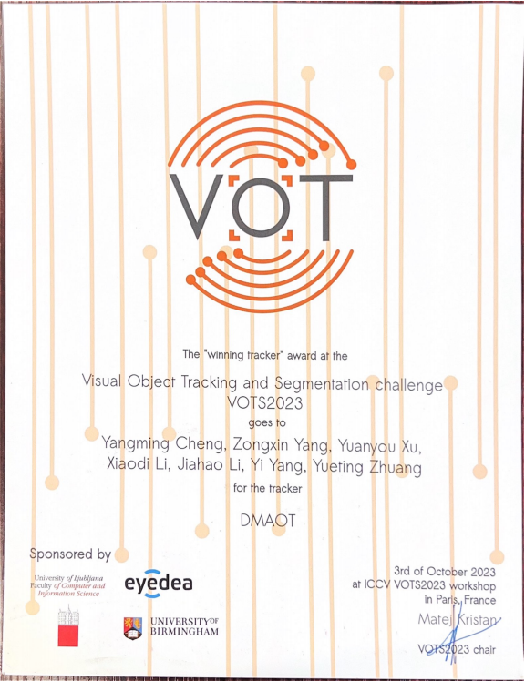
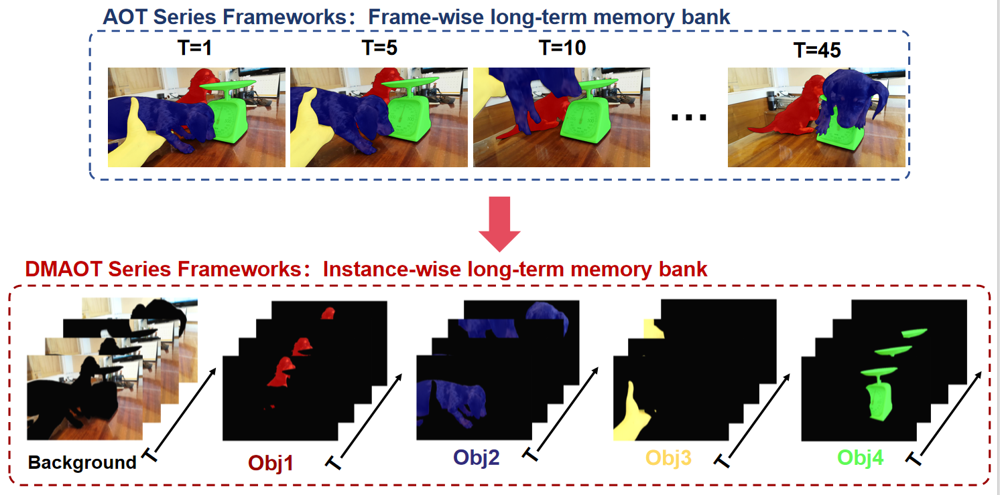
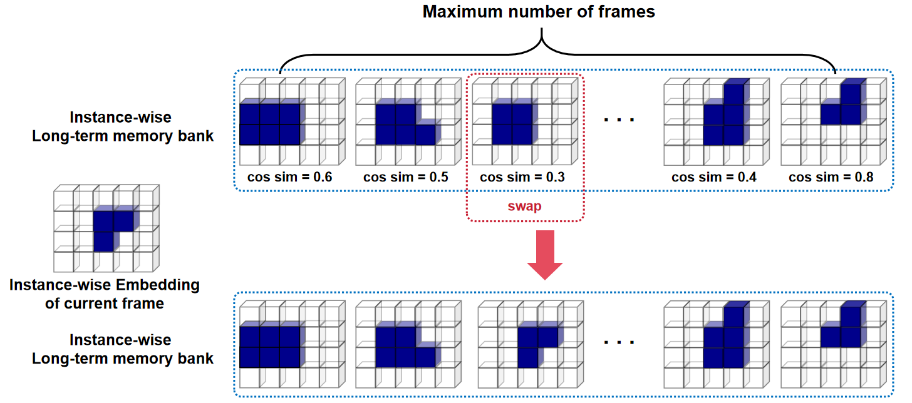

# 🏆VOTS 2023 Winner: DMAOT（Decoupled Memory AOT）

## Intro
DMAOT ranked **1st** in the [**VOTS 2023**](https://www.votchallenge.net/vots2023/) challenge ([leaderboard](https://eu.aihub.ml/competitions/201#results)). As a plug-and-play method, DMAOT enhances the segmentation ability of AOT series algorithms in long-time videos without requiring any training process.
<!-- 插入奖状 -->
<p align="center"> </p>

### Instance-wise long-term memories
We decouple the **frame-wise long-term memory** used in the AOT series frameworks and transform it into **instance-wise long-term memory**. This enhancement provides more precise control over the long-term memory bank of each individual, facilitating fine-grained memory management.
<p align="center"> </p>

### Dropout frame strategy based on cosine similarity.
We also utilize the dropout frame strategy based on cosine similarity when the maximum number of frames in the instance-wise long-term memory bank is reached. This strategy ensure each long-term memory bank have higher quality of memories.
<p align="center"> </p>

## Prerequisites

### Install python packages
- Create a new conda environment
```
conda create -n dmaot python=3.8
conda activate dmaot
```
- Then run,
```
bash install.sh
```
### Download pretrained model
- Pretrained models of AOT and DeAOT can be downloaded from [here](https://github.com/yoxu515/aot-benchmark/blob/main/MODEL_ZOO.md).
- We also utilize the SwinB-DeAOT model trained on a larger dataset, and the pretrained weights can be downloaded from [here](https://drive.google.com/file/d/1KTJdR354BtFEGTrA_a4fcKUUHe2woxtn/view?usp=sharing).
- Put the pretrained weight in `./pretrained_models`.
## Prepare data
- To initialize the workspace using VOT-Toolkit
```
vot initialize vots2023 --workspace <workspace-path>
```

## Run tracker
### Edit configuration files
- Edit the `paths` and `env_PATH` in `trackers.ini`.
- Edit the `workspace-path` in `evaluate.sh`.
- The detailed documentation on how to use VOT-Toolkit can be found on the [VOT Official website](https://www.votchallenge.net/howto/).

### Get results
```
bash evaluate.sh
```
### Evaluate

- To zip file using VOT-Toolkit
```
vot pack --workspace <workspace-path> <tracker-name>
```
- Upload to [evaluation server](https://eu.aihub.ml/competitions/201). More detail can find in [here](https://www.votchallenge.net/vots2023/participation.html).

## Thanks
DMAOT are based on the [AOT-Benchmark](https://github.com/yoxu515/aot-benchmark), which supports both AOT and DeAOT now. Thanks for such an excellent implementation.

## Citations
Please consider citing the related paper(s) in your publications if it helps your research.
```
@inproceedings{yang2022deaot,
  title={Decoupling Features in Hierarchical Propagation for Video Object Segmentation},
  author={Yang, Zongxin and Yang, Yi},
  booktitle={Advances in Neural Information Processing Systems (NeurIPS)},
  year={2022}
}
@article{yang2021aost,
  title={Scalable Video Object Segmentation with Identification Mechanism},
  author={Yang, Zongxin and Wang, Xiaohan and Miao, Jiaxu and Wei, Yunchao and Wang, Wenguan and Yang, Yi},
  journal={arXiv preprint arXiv:2203.11442},
  year={2023}
}
@inproceedings{yang2021aot,
  title={Associating Objects with Transformers for Video Object Segmentation},
  author={Yang, Zongxin and Wei, Yunchao and Yang, Yi},
  booktitle={Advances in Neural Information Processing Systems (NeurIPS)},
  year={2021}
}
@inproceedings{kristan2023first,
  title={The first visual object tracking segmentation vots2023 challenge results},
  author={Kristan, Matej and Matas, Ji{\v{r}}{\'\i} and Danelljan, Martin and Felsberg, Michael and Chang, Hyung Jin and Zajc, Luka {\v{C}}ehovin and Luke{\v{z}}i{\v{c}}, Alan and Drbohlav, Ondrej and Zhang, Zhongqun and Tran, Khanh-Tung and others},
  booktitle={Proceedings of the IEEE/CVF International Conference on Computer Vision},
  pages={1796--1818},
  year={2023}
}
@article{cheng2023segment,
  title={Segment and Track Anything},
  author={Cheng, Yangming and Li, Liulei and Xu, Yuanyou and Li, Xiaodi and Yang, Zongxin and Wang, Wenguan and Yang, Yi},
  journal={arXiv preprint arXiv:2305.06558},
  year={2023}
}
```
## License
This project is released under the BSD-3-Clause license. See [LICENSE](./LICENSE) for additional details.